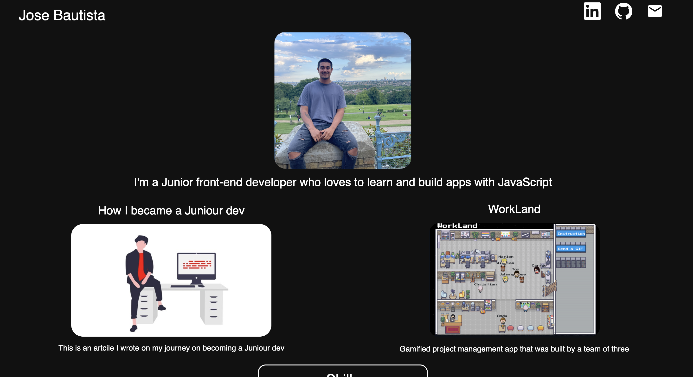

# Welcome to my portfolio
I wanted to get out of my comfort zone for this so I decided to build it on [Next.js](https://nextjs.org/) with [Tailwind CSS](https://tailwindcss.com/) for my framework. The app is deployed on [Vercel](https://vercel.com/home?utm_source=next-site&utm_medium=banner&utm_campaign=next-website) so please have take a moment to take a look at it here [My Portfolio](https://joses-portfolio.vercel.app/). 

## Stack for this project
* React.js
* Tailwind CSS
* Css (for small animations)

## Portfolio
